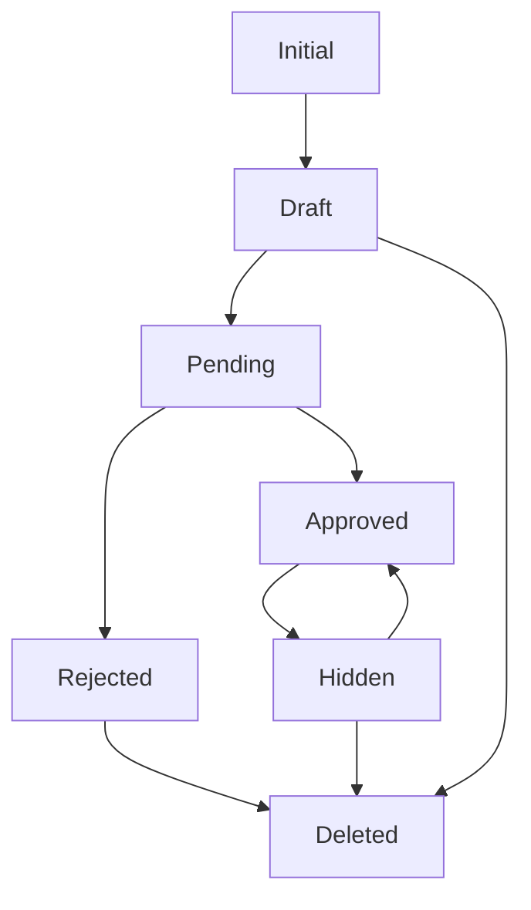

# Pixly - Professional Stock Photo Platform

A modern, full-stack stock photo sharing platform built with .NET 8 and Angular 18, featuring intelligent image management, advanced search capabilities, comprehensive admin dashboard, payment integration, and seamless user experience.

## 🌟 Project Overview

Pixly is a production-ready stock photo platform that enables photographers to share their work and users to discover high-quality images. The platform combines enterprise-grade backend architecture with a responsive, modern frontend to deliver exceptional performance and user experience.

## ✨ Key Features

### 🔍 Advanced Search & Discovery
- **Smart Search Engine** - Real-time search suggestions with autocomplete
- **Multi-dimensional Filtering** - Filter by orientation (landscape, portrait, square), size (small, medium, large), and popularity
- **Tag-based Search** - Comprehensive tagging system with search suggestions
- **Infinite Scroll Gallery** - Masonry layout with lazy loading for optimal performance

### 👤 User Management & Authentication
- **Secure JWT Authentication** - Industry-standard token-based authentication
- **Email Verification System** - Required email confirmation with styled HTML templates
- **Two-Factor Authentication** - Optional 2FA via email codes for enhanced security
- **Refresh Token Rotation** - Automatic token refresh with security breach detection
- **Rate Limiting** - Multi-layer protection against abuse (IP, email, user-based)
- **Profile Management** - User profiles with avatar upload and settings

### 📸 Photo Lifecycle Management
- **State Machine Pattern** - Robust workflow: Draft → Pending → Approved/Rejected → Published
- **Drag & Drop Upload** - Intuitive file upload with preview and validation
- **Cloud Image Processing** - Cloudinary integration with automatic optimization and transformations
- **Admin Photo Management** - Complete photo management through admin dashboard including approval workflow
- **Batch Operations** - Admin bulk approve/reject functionality via dashboard interface
- **Photo Status Tracking** - Real-time monitoring of photo states through admin interface
- **Like & Save System** - User interaction tracking with real-time updates

### 💳 Payment & Commerce System
- **Stripe Integration** - Secure payment processing for photo purchases
- **Checkout Sessions** - Dynamic checkout creation for individual photos
- **Payment Verification** - Manual payment verification system with session tracking
- **Purchase History** - Complete user purchase tracking and history
- **Revenue Tracking** - Admin dashboard for monitoring earnings and transactions

### 📊 Reporting System
- **User-Generated Reports** - Client-side report creation for inappropriate content
- **Report Categories** - Multiple report types (spam, inappropriate content, copyright infringement)
- **Admin Report Management** - Complete report investigation and resolution through admin dashboard
- **Report Status Tracking** - Pending, Under Review, Resolved, Dismissed states
- **Detailed Investigation Tools** - Report preview with user context and photo information

### 🛡️ Admin Dashboard
- **Comprehensive Analytics** - User metrics, photo statistics, earnings tracking, and active users
- **Visual Data Representation** - Interactive charts showing platform growth and performance metrics
- **Content Moderation** - Photo approval workflow with preview, bulk actions, and status management
- **Photo Management** - Review pending photos, approve/reject submissions, view approved content
- **Report Management** - Handle user-generated reports, investigate issues, and resolve disputes
- **Active Reports Monitoring** - Real-time tracking of pending reports with detailed resolution tools
- **Revenue Dashboard** - Stripe payment tracking and earnings overview
- **System Monitoring** - Daily upload tracking and performance metrics
- **Responsive Design** - Mobile-first admin interface (minimum 1000px width)

### 🎨 Modern UI/UX
- **Responsive Design** - Optimized for all device sizes
- **Dynamic Theming** - Consistent color scheme with hover effects
- **Loading States** - Smooth loading indicators with minimum display time
- **Toast Notifications** - Real-time feedback for all user actions
- **Accessibility** - WCAG compliant with keyboard navigation

## 🏗️ Architecture Deep Dive

### Backend Architecture (.NET 8)
```
Pixly-BE/
├── Pixly.API/                 # Presentation Layer
│   ├── Controllers/           # REST API endpoints
│   │   ├── AdminController.cs      # Admin dashboard analytics
│   │   ├── AuthController.cs       # Authentication & user management
│   │   ├── CRUDController.cs       # Generic CRUD operations base
│   │   ├── PaymentController.cs    # Stripe payment integration
│   │   ├── PhotoController.cs      # Photo management & interactions
│   │   ├── ReportController.cs     # User reporting system
│   │   ├── TagController.cs        # Tag management
│   │   └── UserController.cs       # User profile management
│   ├── Extensions/            # Service registrations and middleware
│   ├── Filters/              # Request validation filters
│   └── Middleware/           # Custom middleware pipeline
├── Pixly.Services/           # Business Logic Layer
│   ├── Services/             # Domain services implementation
│   ├── Database/             # Entity Framework models
│   ├── StateMachines/        # Photo lifecycle state management
│   ├── Interfaces/           # Service contracts
│   └── Settings/             # Configuration models
└── Pixly.Models/             # Data Transfer Layer
    ├── DTOs/                 # Data transfer objects
    ├── Request/              # API request models
    ├── Response/             # API response models
    └── SearchRequest/        # Search and pagination models
```

### Frontend Architecture (Angular 18)
```
Pixly-FE/src/app/
├── core/                     # Core Module
│   ├── guards/               # Route guards (Auth, Search)
│   ├── interceptors/         # HTTP interceptors (JWT, Error, Loading)
│   ├── services/             # Application services
│   ├── state/               # Application state management
│   └── models/              # TypeScript interfaces
├── features/                 # Feature Modules
│   ├── home/                # Landing page and hero section
│   ├── search/              # Advanced search with filters
│   ├── upload/              # Multi-step photo upload
│   ├── admin/               # Admin dashboard (Overview, Content Management, Reports)
│   ├── auth/                # Login/Register with validation
│   ├── profile/             # User profile management
│   ├── payment/             # Stripe checkout integration
│   └── reports/             # User report creation interface
└── shared/                   # Shared Components
    ├── components/           # Reusable UI components
    └── services/            # Shared business logic
```

## 🛠️ Technology Stack

### Backend Technologies
- **.NET 8** - Latest long-term support framework
- **Entity Framework Core 8** - Advanced ORM with migrations
- **SQL Server** - Production database with comprehensive seeding
- **Cloudinary** - Cloud image management with transformations
- **Stripe API** - Secure payment processing for photo purchases
- **RabbitMQ** - Message broker for email queuing
- **JWT Bearer Authentication** - Secure token-based auth
- **Mapster** - High-performance object mapping
- **DotNetEnv** - Environment configuration management

### Frontend Technologies
- **Angular 18** - Latest framework with standalone components
- **TypeScript** - Type-safe development
- **RxJS** - Reactive programming patterns
- **Bootstrap 5** - Responsive UI framework
- **Chart.js** - Data visualization for admin dashboard
- **Font Awesome** - Professional icon library
- **TinyColor** - Color manipulation utilities

## 📡 Complete API Reference

### Authentication Endpoints
```http
POST   /api/auth/register                    # User registration
POST   /api/auth/login                       # User authentication
POST   /api/auth/logout                      # Secure logout
GET    /api/auth/current-user                # Get authenticated user
POST   /api/auth/refresh-token               # Token refresh
GET    /api/auth/confirm-email               # Email confirmation
POST   /api/auth/resend-confirmation-email   # Resend confirmation
POST   /api/auth/setup-2fa                   # Enable 2FA
GET    /api/auth/generate-2fa-code           # Generate 2FA code
POST   /api/auth/two-factor                  # Verify 2FA
```

### Photo Management
```http
GET    /api/photo                           # Paginated photo listing
GET    /api/photo/{id}                      # Photo details by ID
GET    /api/photo/slug/{slug}               # Photo by SEO-friendly slug
POST   /api/photo                           # Upload new photo
PATCH  /api/photo/{id}                      # Update photo metadata
GET    /api/photo/search-suggestion/{title} # Real-time search suggestions
GET    /api/photo/preview/{id}              # Get photo preview link
GET    /api/photo/orginal/{id}              # Get original photo link
POST   /api/photo/{photoId}/like            # Like photo
DELETE /api/photo/{photoId}/like            # Unlike photo
POST   /api/photo/{photoId}/save            # Save to favorites
DELETE /api/photo/{photoId}/save            # Remove from favorites
GET    /api/photo/{id}/allowed-actions      # Get available actions
```

### Admin Photo Actions
```http
POST   /api/photo/{id}/submit               # Submit for review
POST   /api/photo/{id}/approve              # Approve photo
POST   /api/photo/{id}/reject               # Reject photo
POST   /api/photo/{id}/edit                 # Return to draft
POST   /api/photo/{id}/hide                 # Hide from public
POST   /api/photo/{id}/delete               # Soft delete
POST   /api/photo/{id}/restore              # Restore deleted photo
```

### Payment Integration
```http
POST   /api/payment/create-checkout-session    # Create Stripe checkout session
POST   /api/payment/verify-payment/{sessionId} # Verify payment completion
GET    /api/payment/purchases                  # Get user purchase history
GET    /api/payment/purchase/session/{sessionId} # Get purchase by session ID
```

### Content Management
```http
GET    /api/tag                             # Tag management
POST   /api/tag                             # Create new tag
PATCH  /api/tag/{id}                        # Update tag
GET    /api/report                          # Report management (paginated)
POST   /api/report                          # Submit new report
PATCH  /api/report/{id}                     # Update report status
GET    /api/report/reportTypes              # Get all report types
GET    /api/admin                           # Dashboard analytics and overview
```

### User Management
```http
GET    /api/user                            # User listing (admin)
GET    /api/user/{id}                       # User details
PATCH  /api/user/{id}                       # Update user profile
```

## 🚀 Getting Started

### Prerequisites
- **.NET 8 SDK** (8.0 or later)
- **Node.js 18+** and npm
- **SQL Server** (LocalDB, Express, or full version)
- **Docker** (optional, for RabbitMQ)
- **Cloudinary Account** (free tier available)
- **Stripe Account** (for payment processing)

### Environment Configuration

Create a `.env` file in `Pixly-BE/` directory:

```env
# Database Configuration
DB_CONNECTION_STRING=Server=localhost;Database=PixlyDb;Trusted_Connection=true;TrustServerCertificate=true;

# JWT Security Settings
JWT_SECRET=your-super-secure-secret-key-minimum-32-characters-long
JWT_ISSUER=Pixly
JWT_AUDIENCE=PixlyUsers

# Cloudinary Integration
CLOUDINARY_CLOUDNAME=your-cloudinary-cloud-name
CLOUDINARY_APIKEY=your-cloudinary-api-key
CLOUDINARY_APISECRET=your-cloudinary-api-secret

# Stripe Payment Processing
STRIPE_PUBLISHABLE_KEY=pk_test_your_stripe_publishable_key
STRIPE_SECRET_KEY=sk_test_your_stripe_secret_key
STRIPE_WEBHOOK_SECRET=whsec_your_webhook_secret

# SMTP Email Settings
SMTP_HOST=smtp.gmail.com
SMTP_PORT=587
SMTP_USERNAME=your-email@gmail.com
SMTP_PASSWORD=your-gmail-app-password
SMTP_ENABLE_SSL=true
SMTP_FROM_EMAIL=your-email@gmail.com
SMTP_FROM_NAME=Pixly Team

# RabbitMQ Message Broker (Optional)
RABBITMQ_HOST=localhost
RABBITMQ_USER=guest
RABBITMQ_PASSWORD=guest
RABBITMQ_PORT=5672
```

### Backend Setup

1. **Clone and Navigate:**
```bash
git clone https://github.com/yourusername/pixly.git
cd pixly/Pixly-BE
```

2. **Database Setup:**
```bash
cd Pixly.Services
dotnet ef database update
cd ../Pixly.API
```

3. **Start Backend:**
```bash
dotnet run
# API available at: https://localhost:7136
# Swagger UI: https://localhost:7136/swagger
```

### Frontend Setup

1. **Navigate and Install:**
```bash
cd ../Pixly-FE
npm install
```

2. **Development Server:**
```bash
ng serve
# Application: http://localhost:4200
```

3. **Production Build:**
```bash
ng build --prod
```

### Optional: RabbitMQ Setup

For email queuing functionality:
```bash
docker run -d --name pixly-rabbitmq \
  -p 5672:5672 -p 15672:15672 \
  rabbitmq:3-management

# Management UI: http://localhost:15672 (guest/guest)
```

## 🔐 Security Implementation

### Multi-Layer Authentication
- **JWT Tokens** - 15-minute access tokens with secure refresh mechanism
- **Token Rotation** - Automatic refresh token rotation prevents replay attacks
- **Session Management** - Maximum 5 concurrent sessions per user
- **Token Reuse Detection** - Automatic session termination on security breach

### Rate Limiting Strategy
```typescript
// Multiple rate limiting policies
- auth-email: 10 requests per 5 minutes (by email + IP)
- ip-only: 20 requests per minute (by IP)
- email-only: 5 requests per minute (by authenticated user)
- Global: 1000 requests per hour (by IP)
```

### Data Protection
- **Email Confirmation** - Required for account activation
- **Two-Factor Authentication** - Email-based 2FA with 15-minute expiration
- **Password Requirements** - Strong password policy with validation
- **CORS Configuration** - Restricted origins for production security

## 📊 Admin Dashboard Features

### Analytics Dashboard
- **User Growth Metrics** - Registration and engagement tracking with visual charts
- **Photo Statistics** - Upload trends, approval rates, and pending submissions
- **Revenue Analytics** - Stripe payment tracking and earnings overview
- **Active User Monitoring** - Real-time user activity and engagement metrics
- **Interactive Charts** - Dynamic data visualization with Chart.js
- **Configurable Time Periods** - 7, 30, 90, and 365-day views
- **Platform Overview** - Comprehensive dashboard showing key platform metrics

### Content Moderation via Admin Dashboard
- **Photo Review Queue** - Centralized photo approval workflow
- **Pending Photos Management** - Review and approve/reject photo submissions
- **Approved Content Overview** - Monitor all approved photos with filtering options
- **Bulk Operations** - Approve/reject multiple photos simultaneously
- **State Management** - Visual photo lifecycle tracking and status updates
- **Preview Modal** - Full-size photo preview with metadata and user information

### Report Management System via Admin Dashboard
- **Active Reports Monitoring** - Real-time tracking of all pending user reports
- **Report Investigation** - Detailed report preview with photo and user context
- **Client-Side Report Creation** - Users can report inappropriate photos directly from the interface
- **Report Categories** - Multiple report types (spam, inappropriate, copyright, etc.)
- **Status Management** - Pending, Under Review, Resolved, Dismissed workflow
- **Resolution Tools** - Complete report handling and dispute resolution through admin interface
- **Admin Notes** - Internal documentation and investigation notes for each report

## 🎨 Frontend Architecture Highlights

### State Management
```typescript
// Centralized auth state
AuthState - JWT token management and user session
SearchService - Search parameters and suggestions
PhotoService - Photo data and pagination
UploadService - File upload state management
PaymentService - Stripe integration and purchase tracking
```

### Component Architecture
```typescript
// Reusable components with consistent API
- TextInputComponent - Form input with validation
- DropdownComponent - Multi-mode dropdown (filters, selections)
- PhotoCardComponent - Interactive photo display
- GalleryComponent - Infinite scroll masonry layout
- LoadingComponent - Global loading state management
- ReportModalComponent - User report creation interface
```

### Advanced Features
- **Infinite Scroll** - Performance-optimized photo loading
- **Search Suggestions** - Real-time autocomplete with debouncing
- **Image Transformations** - Dynamic sizing based on orientation
- **Toast Notifications** - Non-intrusive user feedback
- **Mobile Responsiveness** - Adaptive layouts for all screen sizes
- **Stripe Checkout** - Seamless payment integration

## 🔄 Photo State Machine

Sophisticated workflow management ensures data integrity:



### State Transitions
- **Initial → Draft** - Photo uploaded, metadata incomplete
- **Draft → Pending** - Submitted for admin review
- **Pending → Approved** - Admin approval, photo goes live
- **Pending → Rejected** - Admin rejection, photographer notified
- **Approved → Hidden** - Temporary removal from public view
- **Any → Deleted** - Soft deletion with restore capability

## 🚀 Performance Optimizations

### Backend Optimizations
- **Generic CRUD Services** - Reduce code duplication
- **In-Memory Caching** - Frequently accessed data caching
- **Database Indexing** - Optimized queries for search operations
- **Async Operations** - Non-blocking I/O throughout the application
- **Connection Pooling** - Efficient database connection management

### Frontend Optimizations
- **Lazy Loading** - Route-based code splitting
- **OnPush Change Detection** - Optimized Angular change detection
- **Image Optimization** - Cloudinary transformations for responsive images
- **Service Workers** - Offline capabilities and caching
- **Bundle Optimization** - Tree shaking and minification

## 🧪 Testing Strategy

### Backend Testing
```bash
# Unit tests for services
dotnet test Pixly.Services.Tests

# Integration tests for API
dotnet test Pixly.API.Tests

# Coverage report
dotnet test --collect:"XPlat Code Coverage"
```

### Frontend Testing
```bash
# Unit tests
ng test

# End-to-end tests
ng e2e

# Coverage report
ng test --code-coverage
```

## 🔮 Future Roadmap

### Phase 1 - Enhanced User Experience (Q2 2024)
- [ ] **User Profiles** - Public photographer portfolios with bio and stats
- [ ] **Collections** - Organize saved photos into themed collections
- [ ] **Advanced Search** - Visual similarity search using AI
- [ ] **Download History** - Track user download history and preferences

### Phase 2 - Social & Commerce (Q3 2024)
- [ ] **Follow System** - Follow favorite photographers
- [ ] **Comments & Reviews** - Community engagement features
- [ ] **Enhanced Payment Features** - Subscription models and bulk purchases
- [ ] **Photographer Earnings** - Revenue sharing system and analytics

### Phase 3 - AI & Machine Learning (Q4 2024)
- [ ] **AI Auto-Tagging** - Automatic image recognition and tagging
- [ ] **Smart Recommendations** - Personalized photo suggestions
- [ ] **Content Moderation AI** - Automated inappropriate content detection
- [ ] **Trend Analysis** - AI-powered trending content identification

### Phase 4 - Enterprise Features (2025)
- [ ] **Team Accounts** - Organization management and shared libraries
- [ ] **Advanced Analytics** - Detailed insights for photographers
- [ ] **API for Developers** - Public API for third-party integrations
- [ ] **White-label Solution** - Customizable platform for other businesses

## 📈 Production Deployment

### Backend Deployment (Azure/AWS)
```bash
# Docker deployment
docker build -t pixly-api .
docker run -p 8080:8080 pixly-api

# Azure App Service
az webapp deployment source config-zip \
  --resource-group pixly-rg \
  --name pixly-api \
  --src release.zip
```

### Frontend Deployment (Vercel/Netlify)
```bash
# Build for production
ng build --prod

# Deploy to Vercel
vercel --prod

# Deploy to Netlify
netlify deploy --prod --dir dist/pixly-fe
```

## 📚 Contributing

We welcome contributions! Please read our [Contributing Guidelines](CONTRIBUTING.md) and [Code of Conduct](CODE_OF_CONDUCT.md).

### Development Workflow
1. Fork the repository
2. Create a feature branch: `git checkout -b feature/amazing-feature`
3. Commit changes: `git commit -m 'Add amazing feature'`
4. Push to branch: `git push origin feature/amazing-feature`
5. Open a Pull Request

### Code Standards
- **Backend**: Follow .NET coding conventions and SOLID principles
- **Frontend**: Adhere to Angular style guide and use TypeScript strictly
- **Testing**: Maintain minimum 80% code coverage
- **Documentation**: Update relevant documentation for new features

## 🐛 Troubleshooting

### Common Issues

**Database Connection Issues:**
```bash
# Update connection string in .env
# Ensure SQL Server is running
# Check firewall settings
```

**Cloudinary Upload Failures:**
```bash
# Verify API credentials in .env
# Check file size and format restrictions
# Ensure network connectivity
```

**Stripe Payment Issues:**
```bash
# Verify Stripe keys (test/live environment)
# Check webhook endpoint configuration
# Ensure SSL certificate for production
```

**Email Not Sending:**
```bash
# Gmail: Use app passwords, enable less secure apps
# Check SMTP settings and credentials
# Verify RabbitMQ is running for queued emails
```

## 📄 License

This project is licensed under the MIT License - see the [LICENSE](LICENSE) file for details.

## 🏆 Acknowledgments

- **Microsoft** - For the excellent .NET ecosystem
- **Angular Team** - For the robust frontend framework
- **Cloudinary** - For powerful image management capabilities
- **Stripe** - For secure payment processing
- **Community** - For open-source libraries and inspiration
- **Contributors** - Everyone who helped make this project better

## 📞 Support

- **Email**: teampixly@gmail.com

---

**Built with ❤️ by the Pixly Team**

*This project demonstrates modern full-stack development practices, clean architecture principles, and production-ready features. Perfect for learning advanced .NET and Angular concepts or as a foundation for your own stock photo platform.*

**Our gallery**


